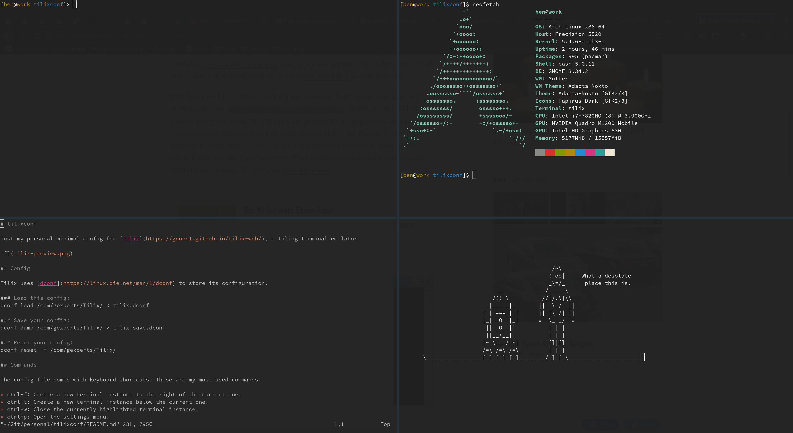

# tilixconf

Just my personal minimal config for [tilix](https://gnunn1.github.io/tilix-web/), a tiling terminal emulator.

## Config

Tilix uses [dconf](https://linux.die.net/man/1/dconf) to store its configuration.

### Load this config:
dconf load /com/gexperts/Tilix/ < tilix.dconf

### Save your config:
dconf dump /com/gexperts/Tilix/ > tilix.save.dconf

### Reset your config:
dconf reset -f /com/gexperts/Tilix/

## Commands

The config file comes with keyboard shortcuts. These are my most used commands:

* ctrl+f: Create a new terminal instance to the right of the current one.
* ctrl+t: Create a new terminal instance below the current one.
* ctrl+w: Close the currently highlighted terminal instance.
* ctrl+p: Open the settings menu.
* ctrl+q: Close tilix.
